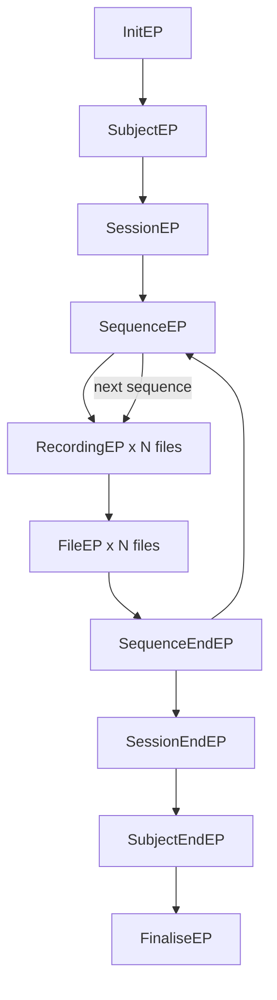

# BIDSme plugin lifecycle and object interface (high-level)

This document describes the shared high-level structure of the custom plugins in this repository.
It applies to both prepare and bidsify plugins, which follow the same callback lifecycle.

## 1) Lifecycle of a plugin

The plugin is executed through a fixed sequence of callback functions.

1. `InitEP(source, destination, dry, **kwargs)`
   - Runs once at startup.
   - Typical role: initialize global state, parse plugin options, validate required inputs.

2. `SubjectEP(scan)`
   - Runs when entering a subject.
   - Typical role: subject-level setup (for example ID handling, subject metadata bookkeeping).

3. `SessionEP(scan)`
   - Runs when entering a session.
   - Typical role: reset per-session state, initialize counters, create session-level context.

4. `SequenceEP(recording)`
   - Runs once per sequence (first file of sequence).
   - Typical role: sequence-level checks and extraction of sequence-global information.

5. `RecordingEP(recording)`
   - Runs for each file in the sequence.
   - Typical role: per-file checks, per-file metadata extraction, dynamic values for mapping.

6. `FileEP(path, recording)`
   - Runs after a file is copied/handled.
   - Typical role: optional post-copy checks or file-level side effects.

7. `SequenceEndEP(path, recording)`
   - Runs after all files of one sequence are processed.
   - Typical role: finalize sequence-level aggregates.

8. `SessionEndEP(scan)`
   - Runs after all sequences of the session are processed.
   - Typical role: write session-level summaries/warnings and reset session state.

9. `SubjectEndEP(scan)`
   - Runs after all sessions of one subject are processed.
   - Typical role: subject-level finalization and copy/export of subject side files.

10. `FinaliseEP()`
    - Runs once after all data is processed.
    - Typical role: global cleanup/final checks.

## 2) Recurring implementation patterns

Across prepare and bidsify plugins, the same design patterns are used repeatedly:

- Global counters/state:
  - Session-scoped counters are initialized/reset in `SessionEP` and `SessionEndEP`.
  - Global variables are used to keep state across callbacks.

- `recId`-based routing:
  - Sequence logic is commonly selected by `recording.recId()` string/prefix checks.
  - This enables protocol-specific handling while keeping the callback structure generic.

- Module guards:
  - Code usually starts with `if recording.Module() == "MRI":` before MRI-specific logic.

- Metadata access via recording attributes:
  - Metadata is pulled through `recording.getAttribute("...")`.
  - Different conversion outputs (SPM DICOM import vs dcm2niix) are handled by querying different keys.

- Custom variables for bidsmap placeholders:
  - Derived values are stored in `recording.custom[...]`.
  - These values are then consumed in bidsmaps via `<<custom:...>>` placeholders.

- Optional metadata mutation:
  - Some workflows adjust metadata before mapping using `recording.setAttribute(...)`
    or sequence identifiers (`series_id`, `series_no`) where needed.

## 3) Callback flow (conceptual)

## 4) Scan and recording object options used in this repository

This section lists the object members/methods that are used by the plugins in this repository.

### 4.1 Scan object (`scan`)

- `scan.subject`
  - Current subject identifier (read/write in subject mapping workflows).
- `scan.session`
  - Current session identifier (read/write in session mapping workflows).
- `scan.in_path`
  - Input path of current scope (used for directory/file operations).
- `scan.sub_values`
  - Subject metadata dictionary used to populate participant-level fields.

### 4.2 Recording object (`recording`)

- `recording.Module()`
  - Returns recording module/type (commonly checked for `MRI`).
- `recording.recId()`
  - Returns sequence/recording identifier used for routing logic.
- `recording.recIdentity(...)`
  - Human-readable identity string used in logging/warnings.
- `recording.currentFile(...)`
  - Returns current file path/name (used in parsing and diagnostics).
- `recording.getAttribute("key")`
  - Reads metadata attributes from current recording.
- `recording.getattribute("key")`
  - Variant also present in current codebase (legacy/case variant).
- `recording.setAttribute("key", value)`
  - Writes/overrides metadata attributes before mapping.
- `recording.custom[...]`
  - Dictionary for plugin-defined custom values consumed by bidsmap placeholders.
- `recording.series_id`
  - Sequence identifier field adjusted in some workflows.
- `recording.series_no`
  - Sequence number field adjusted in some workflows.

## 5) Practical note on "extractable options"

Most metadata values are extracted through `recording.getAttribute("...")`, where the key
string determines what is read from the temporary sidecar JSON. Therefore:

- The object-level interface is stable (methods/properties listed above).
- The actual extractable metadata fields depend on conversion method and available keys
  in the current temporary JSON (SPM DICOM import vs dcm2niix).

> Hint: Try to never use the name of a sequence or file for distinguishing logic between files. This is not a stable practice. Rather try to extract a unique identifier from the metadata.
