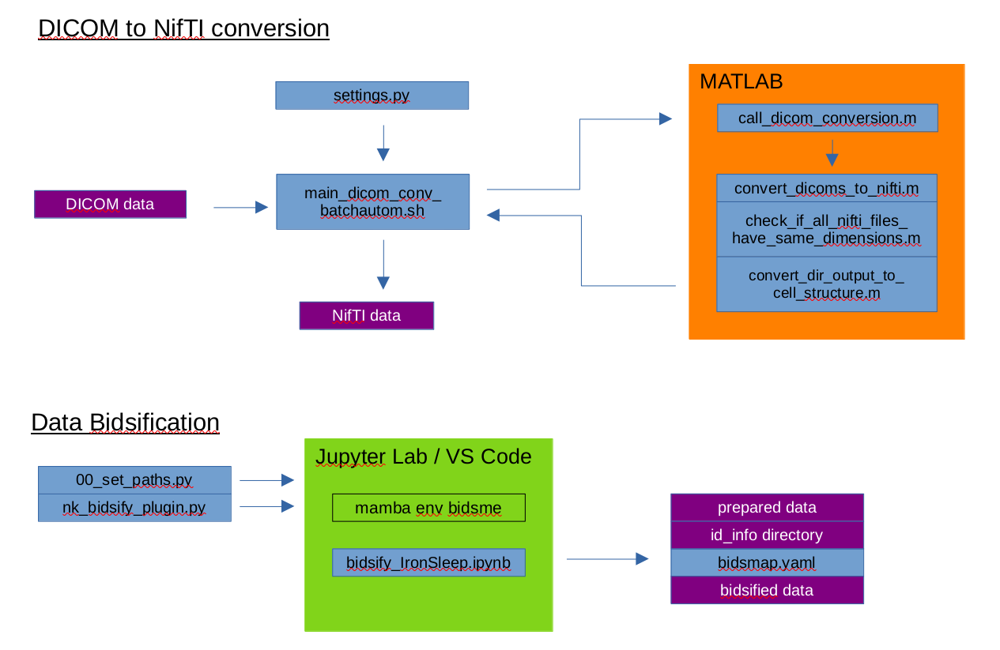

# Documentation: Bidsification of the MRI data

This page describes the bidsification of the MRI acquisition data in NIfTI format (.nii). There are settings implemented to bidsify both the NIfTIs created from the scanner-reconstructed DICOMs and the NIfTIs reconstructed from the raw MRI data using LORAKS. 

> Brain Imaging Data Structure (BIDS) is a standardized way of organizing Neuroimaging data. It makes recommendations for the directory structure, file naming, and metadata storage.<br>
> The standard includes guidelines for multiple imaging techniques. This guide is restricted to MRI data for now.<br>
> For more information on BIDS, please refer to [their documentation](https://bids-specification.readthedocs.io/en/stable/index.html). It is difficult to navigate but the search function is your friend. There are still some inconsistencies in the standard, making exact definitions difficult in some cases.<br>

The scripts that are described on this page are part of the **MPM_bidsification** repository ([Github](https://github.com/IronSleep/MPM_bidsification), [Gitlab](https://gitlab.gwdg.de/cbs-neurophy/bidsification_mpm)). Feel free to clone or fork the repository. If there are problems regarding the permissions, [send me an e-mail](mailto:kuegler@cbs.mpg.de?subject=Permissions%20missing%20MPM_bidsification) (kuegler@cbs.mpg.de) or a message on Minerva (user: kuegler).


## Usage

The Bidsification of the data is performed using *Bidsme*, an open-source tool created by Nikita Beliy (University of Liege, Belgium). It is an all-in-one tool for the re-naming and re-structuring the original data files and extracts and formats the necessary metadata. It is fully customizable due to the option of including custom plugins. Instead of strictly imposing the BIDS structure, Bidsme allows the user to fully configure how the data set will be organized and what metadata will be included, providing maximum flexibility even beyond the limitations of the BIDS standard.<br>

According to the BIDS recommendations, the data is structured in subject directories, which contain a separate directory for each session.<br>

The names of the NIfTI files adhere to the following structure : `subject - session - different entities describing the data - suffix of the acquisition - .nii` <br>
The data files are easily identifiable by their unique names due to the explicit definition of entities by the BIDS standard. <br>
Each .nii file is accompanied by a sidecar JSON file with the same name, which contains all the important metadata. <br>

> The Bidsification code is currently organized in Jupyter notebooks with supplementary python scripts. As *Bidsme* can be used both as Python package and as command line tool, the necessary functions will be called from the command line in the final deployment of the pipeline. However, for development and debugging reasons, it is convenient to use Jupyter notebooks. 


> Hint:
> It is recommended to first bidsify the DICOM-derived data, and then follow with the LORAKS-reconstructed files. Bidsification of just LORAKS data still requires a specific folder structure and possibly some manual adjustments, which is not thoroughly tested.


### Necessary software/repositories

+ **MPM_bidsification**
    + The versions on the [Neurophysics Gitlab](https://gitlab.gwdg.de/cbs-neurophy/bidsification_mpm) and the [IronSleep Github](https://github.com/IronSleep/MPM_bidsification) are identical (mirrored from Gitlab -> Github). However, access to both repositories is restricted. [Reach out](mailto:kuegler@cbs.mpg.de?subject=Permissions%20missing%20MPM_bidsification) if you would like to access the code.
+ **Bidsme**
    + *Bidsme* is freely available on [Github](https://github.com/CyclotronResearchCentre/bidsme/tree/dev) and [Gitlab](https://gitlab.uliege.be/CyclotronResearchCentre/Public/bidstools/bidsme/bidsme). 
    + You **don't** need to manually install *Bidsme*. The **MPM_bidsification** repository provides an environment file `bidsme_env.yml` in the `supplementary/` directory that you can use to create a proper conda environment including *Bidsme* and all its necessary dependencies. This environment may also be used for the previous steps of the pipeline. How to create the environment from the YAML file is described in the steps below.
    + *Alternatively, you can find [instructions for installing Bidsme](https://github.com/CyclotronResearchCentre/bidsme/blob/dev/INSTALLATION.md) to your virtual environment. Bidsme can be installed directly using pip, including the necessary dependencies.*
    + `bidsme_env_adj.yml` creates a conda environment with bidsme installed from a local clone of the repository to allow changes to the bidsme code for debugging and development purposes. The corresponding repository must be available and you have to adjust the path in the `bidsme_env_adj.yml` file to match your particular location.
+ **dcm2niix**
    + You can either clone the [Github repository](https://github.com/rordenlab/dcm2niix) or download the [MRIcroGL viewer](https://www.nitrc.org/projects/mricrogl/) which includes dcm2niix as graphical interface.
    + other install options are by using conda, pip, apt-get, or brew (see the instructions in the `dcm2niix` Github repository)
    + [documentation of dcm2niix](https://www.nitrc.org/plugins/mwiki/index.php/dcm2nii:MainPage#General_Usage) includes information on bvec & bval file creation in the DTI section


### How to run the Bidsification

The bidsification is performed by successively running the code blocks in `bidsify_IronSleep.ipynb`. For the LORAKS-reconstructed data, use `bidsify_IronSleep_loraks.ipynb`.<br>
The scripts will access specified files in the `plugins_bidsme/` and the `supplementary/` directories to perform the different steps of the Bidsification process. All important files are explained in the [**File description**](#file-description-mpm_bidsification-repository) section later on this page.

> Hint:<br>
> It is recommended to use the `main` branch of the repository as it should always contain a working state. However, the latest features may only be available on the `dev` branch.

+ **Step 0:**
    + Set up miniforge, so you can use the conda package manager (you can follow the instructions in [Setting up Conda](https://confluence.mpg.de/x/mkMqAw)).

+ **Step 1:**
    + Create an appropriate virtual environment from the provided `bidsme_env.yml` if you haven't done this in a previous step.
    + Make sure that you don't already have a conda environment with the name `bidsme_env`. You only need to create the environment once.
    + ```
      # cd path/to/MPM_bidsification 					 # navigate to the local clone of the repository
      # conda env create -f supplementary/bidsme_env.yml # create a conda environment from the yaml-file in the supplementary directory
      conda env list									 # check the list of environments for the newly created one "bidsme_env"
      ```

+ **Step 2:**
    + Organize your data as described in [Preparation: Data structure](https://confluence.mpg.de/x/QAoqAw) if you haven't done this already.
    + Your project directory must include a `bids/`, `source/`, and `temp/` directory. The `id_info/` directory will be created during the Bidsification if it does not exist yet. However, if you plan to manually define the mapping of original to BIDS-conform IDs, you need to create it manually before running the Bidsification.
    + The data in the `source/` directory must be organized in descending subject and session directories as described on the Data structure page (see the link above). Each session should contain both a `nii/` directory (NIfTIs from DICOM data) and a `nii_loraks_recon/` directory (LORAKS-reconstructed NIfTIs). Different names of those directories require manual adjustments in the code. 

+ **Step 3:**
    + Connect to a compute server via ssh.
    + ```
      getserver -l	# show a list of available compute servers
      ssh maki 		# connect to maki, manati, or any other compute server
      ```

+ **Step 4:**
    + Activate the virtual environment containing *Bidsme* and all the necessary dependencies.
    + ```
      conda activate bidsme_env   # activate conda environment
      ```

+ **Step 5:**
    + Access the `bidsify_IronSleep.ipynb` and adjust the paths to your needs (1. Section in the notebook).
    + ```
      DATASET_PATH = "/path/to/your/project/directory"
      # adjust the variables SOURCE_PATH, PREPARED_PATH, and BIDSIFIED_PATH if you diverged from the directory naming recommendations
      ```
    + After this, successively execute the cells in the notebook. The different steps are described below.

+ **Step 6: `bidsme.prepare`**

    + In the `bidsify_IronSleep.ipynb`, run the cell containing the `bidsme.prepare` command (3. Section in the notebook).
    + This function successively steps through the different sessions of the different subjects present in the `source/` directory, copies the data and organizes it in a specific temporary folder structure in the `temp/` directory. This is just a preparation and **not** the actual bidsification yet.
    + You have to specify in the `bidsme.prepare` command, where *Bidsme* can find the NIfTI files of the sequences. You have the option to exclude data from this step which will also exclude it from the bidsification in the following steps. However, make sure that you don't miss important data (*e.g.*, If you manually specify your specific sequence names, you may ignore important data when your protocol changes later but you forget to adjust those names).
    + You can pass a custom plugin to the command to apply custom modifications (*e.g.*, `plugin_prepare_nk.py` in the `plugins_bidsme/` directory). 
        + This plugin adjusts subject and session names according to the previously created `.csv` files in the `id_info/` directory (forces a specific naming onto the subjects/sessions). If there are no "ID-files" or not even an `id_info/` directory, the subjects and sessions are numbered with increasing integers (subjects: 3-digits, sessions: 2-digits) and the mapping from their original IDs to the BIDS-conform IDs is documented in newly created `.csv` files in the `id_info/` directory.
        + You have the option to introduce specific features by utilizing plugins, such as defining specific variables based on the recordings metadata which can later be used during the bidsification for custom modifications of the file names and sidecar json values.
    + The "participants" template (`participants.json`) passed to Bidsme's preparation command defines the structure of the `participants.tsv` file. 
        + The creation of the `sub-XXX_sessions.tsv` is not implemented in *Bidsme* and is therefore implemented by the custom preparation plugin `plugin_prepare_nk.py`. It is necessary to pass the path to the `sessions.json` template as `plugin_opt`: `sessions_tsv_template`.
    + The `plugin_opt` argument is used to pass variables to the plugins. Please check your selected plugin for the available `plugin_opt` options, such as:
        + `sessions_tsv_template` - passes the path to the `sessions.json` to the prepare plugin
        + `bidsmap_step` - used to determine if `plugin_bidsify_*.py` is used for the bidsmap creation or for the actual bidsification of the data
        + `include_smaps` - to include sensitivity maps in the LORAKS-reconstructed data 
    + For other arguments of the command (*e.g.*, which subset of subjects to run on if not all), please refer to the help command or the Bidsme documentation.
    + ```
      bidsme.prepare(SOURCE_PATH, PREPARED_PATH, 
                     data_dirs={"nii/*":"MRI",
						         ... },
                     plugin_file="/path/to/plugin_prepare.py",
                     part_template="/path/to/participants.json",
			         plugin_opt={"bool_val":True},      # pass variable to plugin
                     sub_list=['sub-002','sub-003']
                    )     
      ```
    > There are several sanity checks implemented in the plugin. For example, the *Bidsme* logger raises a warning if the shim currents in the different MPM sequences and the TB1AFI acquisition are not constant. Such inconsistencies would probably render the data unusable. However, the data is still bidsified but this warning creates a WARNING file in the corresponding session in the `bids/` directory and notes this problem in the `sub-XXX_sessions.tsv`. *(Warnings don't stop the execution of the function.)*

+ **Step 7: `bidsme.mapper`**

    + In the `bidsify_IronSleep.ipynb`, run the cell containing the `bidsme.mapper` command (4. Section in the notebook).
    + This function creates the `bidsmap.yaml` file. This structured file defines the actual names of the bidsified data and specifies which metadata of the sidecar JSON files in the `temp/` directory will be transferred to the sidecar JSON files of the bidsified data. The mapping information is stored as key-value pairs in human-readable, widely supported YAML files.
        + By default, the file is created in `BIDSIFIED_PATH/code/bidsme/bidsmap.yaml` or, if already present, scanned and extended. 
    + **You can skip this step if you received a bidsmap tailored to your data (such as the various examples provided in `supplementary/bidsmaps/`). Just move the bidsmap to the default location and name or adjust the bidsmap path in the Bidsification notebook.**
    + The creation of the mapping file is an iterative process. Each time the `bidsme.mapper` command is run, it will successively analyze the data in the `temp/` directory. Once it comes across a file with unknown attributes (*e.g.*, `ProtocolName`), it will stop and raise an error. This error can be resolved by adding a new element to the mapping file with this specific `ProtocolName` or `SeriesDescription` in the attribute section. In many cases, *Bidsme* will extend the mapping file with template entries, showing you which fields need to be specified. If not, you can specify manually which template to use by adding a "blank" element, specify only the `model` and `suffix` fields, and add `template: true`. If you now run the `bidsme.mapper` command again, the blank element will be populated with empty fields from the template.
        + Read the error message **carefully** as it often provides good instructions on how to resolve the error(s) or warning(s).
        + You can find more information on how to create a proper Bidsmap in the [documentation in the Bidsme Github repository](https://github.com/CyclotronResearchCentre/bidsme/blob/dev/doc/creating_map.md) (or alternatively in the [Jupyter Notebooks of the bidsme tutorial](https://github.com/CyclotronResearchCentre/bidsme_tutorial)).

    > The naming schema and sidecar JSON fields for a given modality (in this case `MRI`) are defined in `$BIDSME_INSTALLATION_PATH/bidsme/Modules/MRI/_MRI.py`. The list of entities is stored in modalities dictionary. For example, if an image belongs to `anat`, *Bidsme* will load the list of entities from `modalities["anat"]`. The optional `model` field in the bidsmap can force *Bidsme* to use a different list of entities from the modalities dictionary.

    + **I recommend to open the created `bidsmap.yaml` in a code editor (*e.g.*, VS Code) and iteratively re-run the cell and adjust the mapping file.**
        + Repeat this process until the command doesn't raise any warnings or errors.
        + This process can be very tedious and many features are not well documented. Feel free to reach out if you need help ([kuegler@cbs.mpg.de](mailto:kuegler@cbs.mpg.de?subject=Help%20with%20MPM_bidsification) or Minerva messenger user: kuegler).
    + The good thing is that the `bidsmap.yaml` has to be **created only once** including all the different `ProtocolNames` and/or `SeriesDescriptions`. If every session follows the same protocol, you specify the Bidsmap for one session and, thereafter, use it to bidsify your whole data set.
    + The custom plugin `plugin_bidsify_nk.py` allows to custimize the bidsification process, *e.g.* by creating custom variables that can be used within the `bidsmap.yaml`. Plugins are available in the `plugins_bidsme/` directory in the **MPM_bidsification** repository.    
    + The `plugin_opt` argument is used to pass variables to the plugins. Please check your selected plugin for the available `plugin_opt` options, such as:
        + `sessions_tsv_template` - passes the path to the `sessions.json` to the prepare plugin
        + `bidsmap_step` - used to determine if `plugin_bidsify_*.py` is used for the bidsmap creation or for the actual bidsification of the data
            + The option `bidsmap_step == True` should be used in the `bidsme.mapper` step to avoid certain code blocks from running which would raise warnings during the creation of the bidsmap. Warnings stop the execution of `bidsme.mapper` but not that of actual bidsification step.
        + `include_smaps` - to include sensitivity maps in the LORAKS-reconstructed data 
    + ```
      PLUGIN_BIDS = "/path/to/plugin_bidsify.py"
      bidsme.mapper(PREPARED_PATH, BIDSIFIED_PATH, plugin_file=PLUGIN_BIDS,
                    plugin_opt={"bidsmap_step": True},  # pass variable bidsmap_step to plugin
                    sub_list=['sub-002','sub-003']
                   )
      ```
    > The `bidsme.mapper` command stops when the logger raises a warning (`bidsme.prepare` only stops at errors). Therefore, the custom-designed shim current check described in step 6 will stop the execution when shim current inconsistencies are detected. To avoid this, make sure to pass `plugin_opt={"bidsmap_step": True}` to the `plugin_bidsify_nk.py` during the Bidsmap creation step. This option prevents the plugin from running the shim current consistency check which does not influence the `bidsmap.yaml` anyway but is useful during actual data bidsification step. <br>
    > When creating the Bidsmap for LORAKS-reconstructed data, warnings are raised due to the absence of some standard fields in the sidecar JSON files. These warnings terminate the execution of the command. You can find more on this problem in the *very important note* in [Bidsification of LORAKS-reconstructed data](#bidsification-of-loraks-reconstructed-data).

+ **Step 8: `bidsme bidsify`**

    + In the `bidsify_IronSleep.ipynb`, run the cell containing the `!bidsme bidsify` command (5. Section in the notebook).
        + The `!` (exclamation mark) indicates a CLI command called from the Jupyter notebook. Running this step directly in Python is also possible by using the `bidsme.bidsify` function.
    + This function performs the actual bidsification of the data in the `temp/` directory according to the specifications in the `bidsmap.yaml` file. The bidsified data is written to the `bids/` directory.
        + If everything worked well in the previous two steps, no warnings or errors should be raised during the bidsification.
        + Two warnings could arise if you did not include a `README.md` and `dataset_description.json` in the `bids/` directory. Those files are required to make the data set BIDS-conform. You can find templates for each of them in the `supplementary/` directory in the **MPM_bidsification** repository. Please refer to [IronSleep: Data storage structure](https://confluence.mpg.de/x/lAfyAg) or the [BIDS documentation](https://bids-specification.readthedocs.io/en/stable/) for more information about these files.
    + You can use additional flags with the command to specify which subjects/sessions are included in (or excluded from) the bidsification. 
        + Find more information by running `bidsme bidsify --help` in the CLI or `help(bidsme.bidsify)` directly in Python. (Make sure, that the `bidsme_env` environment is activated. Otherwise *Bidsme* is not available.)
    + The same plugin `plugin_bidsify_nk.py` as in the previous step is used (others available in `plugins_bidsme/`).
    + The `plugin_opt` argument can be used to pass variables to the plugins. You can find some explanations in the `bidsme.mapper` step above.
    + Everything described in the previous two steps is now applied to the bidsification and the whole bidsified data set is stored in the `bids/` directory.
    + ```
      MAP_FILE = os.path.join(BIDSIFIED_PATH, "code/bidsme/bidsmap.yaml")
      PLUGIN_FILE_BIDS = "/path/to/plugin_bidsify.py"
      
      !bidsme bidsify $PREPARED_PATH $BIDSIFIED_PATH -b $MAP_FILE --plugin $PLUGIN_FILE_BIDS -o bidsmap_step=False --participants 'sub-002'
      ```
    + It is possible to pass options to the plugins in the different *Bidsme* commands. As this is not quite clear in `bidsme bidsify --help`, passing options to plugins is done by `-o Name1=Value1 Name2=Value2 ...` (no brackets, no commas).
        + Be careful when you use this flag, as the variable type is not always correctly recognized by the Python script when calling the `bidsme bidsify` command from the CLI. <br>
        (*e.g.*, `False` was recognized as string instead of boolean, which causes conditional statements to consider the variable as `True`.)
        + A fix was implemented for arguments with boolean values but it may not cover all possible cases. 
        + Alternatively, you can use the function directly within Python to ensure correct variable types are passed to the plugin.


### Additional functionalities in the repository

#### Bidsification of LORAKS-reconstructed data
The Bidsification of the LORAKS-reconstructed data is also implemented in the repository.<br>

As the metadata of these files varies vastly from the DICOM-imported NIfTIs, I created a separate set of plugins and a different bidsmap for this (`*_loraks*` in the file name).<br>

Please use the `bidsify_IronSleep_loraks.ipynb` for the bidsification of the LORAKS-reconstructed NIfTIs. The steps above can be followed equivalently.<br>

The bidsified LORAKS-reconstructed data is stored in `PROJECT_DIR/bids/derivatives/LORAKS/`. This directory is created during the bidsification. If you alter the folder structure, you need to adjust the plugin:
```
### the following lines need to be commented out in the `plugin_prepare_loraks_nk.py` to work without original BIDS directory

if not os.path.exists(corresponding_bids_data_path):
	raise exceptions.InitEPError(f"Corresponding BIDS directory not found at {corresponding_bids_data_path}")
```
> *Disclaimer: There is no guarantee that the bidsification will work properly when you adjust the folder structure.*


As mentioned before, the Bidsification of the LORAKS-reconstructed data should be performed AFTER the Bidsification of the DICOM-imported data. If there is no bidsified DICOM data, the LORAKS bidsification should still work but there won't be any information on shim current consistency available. This case was also not thoroughly tested, so there may be a few bugs.


> <span style="color:red">**Very important note:**</span><br>
>
> <span style="color:red">During the preparation, WARNINGS will be raised by the logger, claiming that Bidsme was *"Unable to get recording Id for file ..."*. These warnings can be ignored, as they were addressed but the logger output cannot be removed without destroying its functionality. Not raising any warnings would potentially lead to overlooking a other, potentially more severe issue.</span><br>
>
> <span style="color:red">The Bidsmap creation step will raise the same WARNINGS, causing this step to crash early. Until this is fixed, you need to rely on your experience on how to create a proper Bidsmap without the help of this function. If you made a mistake in the `bidsmap.yaml`, the `bidsme bidsify` command will raise an error or you will find the mistake in the resulting sidecar JSON files in the bidsified data (*e.g.*, missing or falsely populated fields). </span><br>
>
> <span style="color:red">The `bidsme bidsify` command will also raise the same WARNINGS but the execution will not stop. Please also ignore these warnings as they were addressed but the logger output remains.</span><br>

#### Bidsification of Terra.X data
After the upgrade of our Terra system to Terra.X (software version XA60), the DICOM format changed significantly. Since the change, the SPM DICOM Import has a few issues extracting all the necessary metadata from the DICOM files. As a solution, you should use **dcm2niix** to convert all DICOM data into NIfTI format. You can find more information on how to do this in the [corresponding section in the DICOM-to-NIfTI conversion documentation](doc_DICOM-to-NIfTI.md#full-dcm2niix-conversion-alternative). <br>

From there on, you can use the same Bidsification pipeline as described above. However, as the metadata structure of the dcm2niix-converted data differs from the SPM DICOM Import data, a separate set of plugins and a different bidsmap is necessary. You can find examples in the `supplementary` directory (labeled 'terrax' or 'dcm2niix'). For the HISTOPARK project, we use data from several scanners. The corresponding plugin and Bidsmap combine the bidsification for `SPM DICOM import` and `dcm2niix`-converted data. <br>


#### Branch alina_data

***Deprecated: This branch is not actively used anymore and will be removed soon. This chapter of the documentation, however, contains explanations of some useful up-to-date features.***

The second branch in the **MPM_bidsification** repository is used to bidsify the data acquired by [Alina Studenova](mailto:studenova@cbs.mpg.de?subject=Question%20about%20MRI%20Dataset). Her data was acquired using the **7T Siemens Terra.X** system, while the IronSleep data was acquired on the **7T Siemens Terra** system. <br>

**Key differences:**

+ A manually created `ids_dates.json` file is used to specify which subjects/sessions are used from the data containing directory. (implemented in `bidsify_Alina.ipynb`)
+ At the last time of testing, the *SPM DICOM Import* did not work for Terra.X data. Therefore *dcm2niix* is used for converting the DICOM data in this data set into NIfTI format. (implemented in `bidsify_Alina.ipynb`)
    + **Important hint:** Checking the [documentation for dcm2niix](https://github.com/rordenlab/dcm2niix/blob/master/docs/source/dcm2niix.rst), it contains the explanation for the `-x`  flag: "... If 'i', images are neither cropped nor rotated to canonical space". While rotation is not really mentioned elsewhere in the documentation this is the relevant bit. Regarding the rotation of the resulting data matrix, it makes a difference setting `-x i` or not (default is `-x n`). [This post](https://github.com/rordenlab/dcm2niix/issues/438#issuecomment-712407835) also explains the issue.
+ A different metadata structure and different sequences require a different bidsmap and adjusted plugins: 
    + `example_bidsmap_alinadata.yaml`
    + `plugin_prepare_nk.py` and `plugin_bidsify_nk.py` were adjusted
    + `plugin_prepare_loraks_nk.py` and `plugin_bidsify_loraks_nk.py` were adjusted
+ The data set contains sensitivity maps. For the DICOM-imported data, they are named according to the properties in the .JSON files. The sensitivity maps can also be included in the LORAKS reconstructions, and thereby in the bidsified data derived from the LORAKS-reconstructed data. The `plugin_opt: include_smaps` must be handed to the plugins, when bidsifying the LORAKS-reconstructed data. 
    + If `include_smaps == True` (only for LORAKS-reconstructed data), there must be one (or more) sensitivity map per contrast (*T1w, PDw, MTw, ...*). By analyzing which sequence was acquired right before or after an smap (helper function `find_smap_modality` with argument `search_direction`), the specific bidsified name of this smap will include the name of the modality which it was acquired for (`_acq` entity). Different custom fields for the Bidsmap are acquired in a similar way and from the attributes in the .JSON files.
+ The `acq_remove_list.json` is used in the `alina_data` branch to defines which sequences should removed from the `temp/` directory before bidsification to account for duplicates due to repeated acquisitions. The list must be populated manually.
+ As multiple files with the same names in different branches create confusion, the supplementary files for this branch are located in a separate `resources/` directory at `PROJECT_DIR/bids/code/resources/`. These files were also copied to the **MPM_repository** to assure version control.
<br>
<br>

<span style="color:red">**If you want to use the repository for your data, quite a few adjustments will probably be necessary. You can use either the IronSleep (_`*_MPM*`_) or the alina_data (_`*_alina*`_) files as starting point depending on the properties of your data.**</span>


## File description (**MPM_bidsification** repository)

***Deprecated: this list may not up-to-date. It should be removed or updated.***

+ `docs/` – directory containing detailed documentation of different things (still worked on)
+ `plugins_bidsme/` – different plugins for different use cases and data sets (find more information about the plugins in the `docs/` directory or directly in the code)
    + `*_prepare*` – used for preparation step
    + `*_bidsify*` – used for bidsification step
    + `*_loraks*` – designed for bidsification of the LORAKS-reconstructed data
    + `plugin_helper_functions.py` - helper functions to be imported and used across all custom plugins
    + `TerraX_data/` – plugins specifically designed for MRI data acquired on Siemens Terra.X systems
        + `plugin_prepare_terrax_dcm2niix_nk.py` – preparation plugin for Terra.X **dcm2niix**-converted data
        + `plugin_bidsify_terrax_dcm2niix_nk.py` – bidsification plugin for Terra.X **dcm2niix**-converted data
    + `liege_data_IronSleep/` – plugins for Liege data from the IronSleep project
        + `plugin_prepare_liege_nk.py` – preparation plugin for Liege data
        + `plugin_bidsify_liege_nk.py` – bidsification plugin for Liege data
        + `plugin_prepare_liege_loraks_nk.py` – preparation plugin for LORAKS-reconstructed Liege data
        + `plugin_bidsify_liege_loraks_nk.py` – bidsification plugin for LORAKS-reconstructed Liege data
    + `combined_dcm2niix_dcmImport/` - plugins designed for combined bidsification of dcm2niix-imported and SPM-imported data (HISTOPARK project)
        + `plugin_prepare_combined_dcm2niix_DcmImport_nk.py` - preparation plugin
        + `plugin_bidsify_combined_dcm2niix_DcmImport_nk.py` - bidsification plugin
    > **Warning:** Make sure that you checked out the correct branch of the repository as the plugins in the main branch and the plugins in the alina_data branch are not equal even though they have the same names.
+ `spm_dicom_import/` - see [DICOM-to-NIfTI documentation](doc_DICOM-to-NIfTI.md)
+ `supplementary/` – all the supplementary functions and scripts needed for the bidsification (aside from the plugins)
    + `bidsmaps/` – `bidsmap.yaml` files created for the bidsification of different data sets
        + `*_MPM*` – for IronSleep data (usually converted with SPM DICOM Import)
        + `*_loraks*` – for LORAKS-reconstructed data
        + `*_terrax_dcm2niix*` – for Terra.X data (adjusted DICOM format) using dcm2niix for DICOM-to-NIfTI conversion 
        + `*_alinadata*` – for Alina's data (see branch `alina_data`; also uses dcm2niix for DICOM-to-NIfTI conversion)
    + `table_templates/` – templates that define the columns in the `.tsv` files in the data set
        + `participants_nk.json` – template for creating the `participants.tsv`
        + `sessions_nk.json` - template for creating the different `sub-XXX_sessions.tsv` files
    + `acq_remove_list.json` (only in the alina_data branch) – defines which sequences should removed from the `temp/` directory before bidsification (usually duplicates due to repeated acquisitions)
    + `bidsme_env.yml` – environment YAML file to create the appropriate conda environment
    + `bidsme_env_adj.yml` - environment YAML file to create conda environment with bidsme installed from a local clone of the repository (allows changes to the bidsme code for debugging and development purposes)
    + `dataset_description.json` – example of a description file (required for a BIDS-conform dataset)
    + `example_readme.md` – example of a README file (required for a BIDS-conform dataset)
+ `bidsify_IronSleep.ipynb` – Jupyter notebook for running the bidsification of the DICOM-imported data
+ `bidsify_IronSleep_loraks.ipynb` – Jupyter notebook for running the bidsification of the LORAKS-reconstructed data
+ `bidsify_Alina.ipynb` (only in the alina_data branch) – Jupyter notebook for running the bidsification of the DICOM-imported data
+ `bidsify_Alina_loraks.ipynb` (only in the alina_data branch) – Jupyter notebook for running the bidsification of the LORAKS-reconstructed data


## (Not documented yet) Functionalities of the different Plugins

## (Not documented yet) Bidsmap Entries


## Issues 

- If there is an issue with Bidsme, which requires code changes within the software itself (e.g., issue with Terra.X data after the software upgrade)
- clone the repository and install the local (properly adjusted) directory with pip
````
pip install -e /path/to/your/package
````

- or from the adjusted environment.yml which contains
```
  - pip:
    - -e /path/to/your/package

conda env create -f environment.yml # to create the environment
conda env update -f environment.yml # to update the environment
```

## ToDos

+ consistency of shim currents must be reviewed (warnings do not occur correctly in some cases, also check if it works for 3T data, what if there are multiple runs of one sequence) -> check different cases and adjust!
+ careful when using dcm2niix for 3T data!! -> Currently, it is not possible to extract the repetition times of the AFI images from dcm2niix-converted data. Therefore, the repetition times are hard-coded in the plugins. I use the repetition times of the 7T protocol, but these are different at 3T. **This needs to be adjusted in the plugins if you use dcm2niix for 3T data!**
+ plugin_prepare_nk -> comment out the part about finding and copying the bvec and bval files (only works if there is only one bvac and one bval file + seems to be implemented in Bidsme now)
+ adjust all paths to Pathlib instead of OS or other path libraries, so that the application will also run on windows machines
+ see code block in chapter Bidsification of LORAKS-reconstructed data: "must be commented out" → could rather be handled by passing a specific plugin_opt
+ write each step as function instead of code in the Jupyter Notebook → can be called from the CLI or from a python script for deployment, also possible to call it from the Jupyter notebook for debugging/testing
+ Include a resources directory for the IronSleep data → move the important files to the bids/code/ directory instead of the repository → also describe this in Step 5
+ Github repo for IronSleep directory (only include code) and alinadata directory (only include code) → version control
+ document plugins and write put this on github as documentation → link to it from confluence
+ document the different bidsmap entries also on github → include in step 7
+ describe transformation of data in the bidsmap (see `action_value` function in `bidsme/Modules/common.py` or described in the Jupyter notebook in section 4)
+ LORAKS-reconstructed bidsification → `bidsme.mapper` with `logger.setLevel("ERROR")` → may fix the issue
+ create an updated flow chart similar to the one below
+ after running the command, create file that documents paths to input directories (or even input files)
+ many of the string comparisons in the plugins are case-sensitive → make the comparisons case-insensitive but keep the actually extracted file name parts identical to the original ones
+ shim current consistency check does not work properly if the .nii data is not organized in sequence directories in the `source/` directory (reason: `session_shim_current_relevant_sequences_counter` is increased in `SequenceEP` in the prepare plugin -> then only copied in the bidsified plugin -> should be refined in the bidsify plugin (sessions.tsv created in the prepare plugin should be only preliminary)) 
    + whole `subN_sessions_dict` should be written in a helper function and then called in both prepare and bidsify plugin
    + for now, I fixed it by making sure that the Niftis are already ordered correctly in the `source/` directory (manually copied them from `temp/` to `source/`)
+ Check what happens if only LORAKS data is bidsified. Will this raise errors if the LORAKS BIDS directory cannot access a BIDS directory created from online-reconstructed data? Other issues?
+ create config file which for plugins which specifies all variable file-specific strings (e.g., "smaps" or "smap")

<br>
<br>

**Deprecated code visualization:**


